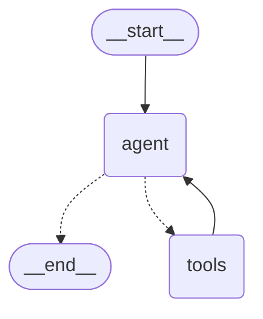

# ReAct loop in LangGraph

A ReAct agent (reason + act) built as an explicit LangGraph state graph. The
loop is small enough to read in one file, and it runs offline so you can see it
work without an API key.

## The loop

Three pieces make up the cycle:

| Piece | Job |
| --- | --- |
| `agent` node | Calls the model. The model either answers or asks for tools. |
| `tools` node | Runs the requested tools and appends the results as `ToolMessage`. |
| `should_continue` | Sends control to `tools` while the model is asking for tools, otherwise ends the run. |

That `agent -> tools -> agent` cycle is the ReAct loop: observe the question,
reason about it, act with a tool, observe the output, and repeat until the model
stops requesting tools.



## Quickstart

```bash
make install   # sync dependencies, including the provider packages
make demo      # run the canned trajectory
```

Without `make`, the same thing is `uv sync --extra openai` then
`uv run python -m react_loop --demo`.

The demo replays a fixed trajectory, so it needs no key:

```
user      > Express shipping costs $15 per order. How much is it for 3 items, and what is the refund window?
assistant> call search_knowledge_base({'query': 'shipping times and refund policy'})
tool     < search_knowledge_base: [refund policy] Refunds are available within 30 days of purchase...
assistant> call calculator({'expression': '15 * 3'})
tool     < calculator: 45
assistant> Express shipping for 3 items costs $45 and arrives in 1-2 business days. Refunds are available within 30 days of purchase.
```

### With a real model

```bash
uv sync --extra openai
export OPENAI_API_KEY=sk-...
uv run python -m react_loop "How much is express shipping for 3 items?"
```

Useful flags: `--provider` (`openai`, `openrouter`, `together`, `groq`,
`ollama`, `anthropic`, `scripted`), `--model`, `--temperature`, `--max-steps`,
`--no-trace`.
In an interactive session, approving a tool remembers that approval for the
rest of the process, so repeated requests for the same tool do not prompt
again. Edited calls and cancellations remain one-off decisions.

### Deep research

Use `--deep-research` for a structured, evidence-focused report instead of a
normal answer:

```bash
uv run python -m react_loop --deep-research \
  "Compare SQLite and PostgreSQL for a small multi-user web application."
```

Research mode instructs the agent to:

- decompose the topic into research questions;
- use Wikipedia for stable background and web search for current or primary
  sources;
- consult multiple independent sources when available;
- distinguish evidence, synthesis, contradictions, and uncertainty;
- return an executive summary, findings, caveats, and numbered sources.

It honors `--max-steps`, `--no-trace`, `--stream`, and `--system-prompt`:

```bash
uv run python -m react_loop --deep-research --max-steps 40 --no-trace \
  "What are the current tradeoffs between serverless and container deployments?"
```

The interactive session supports the same workflow with
`/research <topic>`. A topic is required for command-line deep research.

### Stock research and price scenarios

Deep research automatically includes `stock_market_data` for stock and ETF
topics. It retrieves a bounded quote and daily-price summary from the Yahoo
Finance chart endpoint, then combines that data with web research about
earnings, filings, guidance, competition, macro conditions, and recent news.

```bash
uv run python -m react_loop --deep-research \
  "Research Microsoft (MSFT) and estimate bear, base, and bull 12-month price scenarios."
```

For a requested forecast, the agent must report the data timestamp, forecast
horizon, assumptions, evidence, risks, and scenario ranges. It must not claim
certainty or provide personalized buy, sell, or hold instructions. Market data
can be delayed, unavailable, or incorrect; verify important figures against
official filings and investor-relations sources before making decisions.

The stock tool set also includes:

- `resolve_stock_symbol` for ticker/exchange lookup;
- `stock_fundamentals` for valuation, profitability, leverage, cash flow, and
  company metadata;
- `stock_technicals` for moving averages, RSI, volatility, and drawdown;
- `compare_stocks` for peer tables;
- `stock_backtest` for historical forward-return distributions at a selected
  trading-day horizon.

Bare Indian symbols are resolved through Yahoo Finance when needed. NSE and
BSE aliases are supported as `CEAT`, `CEAT.NS`, `NSE:CEAT`, `CEAT.BO`, and
`BSE:CEAT`; Yahoo may return the issuer's canonical symbol such as
`CEATLTD.NS`.

Yahoo chart observations are cached in memory for 60 seconds and chart
requests are paced within each process to avoid repeated or bursty requests.
Tool output identifies the data source; web-search results retain returned
titles and URLs for report provenance. Historical backtests describe past
distributions only and are not predictive forecasts.

Use `--format` and `--output` to export one-shot reports:

```bash
uv run python -m react_loop --deep-research --no-trace \
  --format json --output report.json "Research MSFT and its peers."
uv run python -m react_loop --deep-research --no-trace \
  --format html --output report.html "Research MSFT and its peers."
```

Supported formats are `text`, `markdown`, `json`, and `html`. JSON includes
the question, generation timestamp, full answer, and extracted source entries.
HTML is standalone and safe to open without the application.

Interactive sessions provide market controls:

```text
/stock MSFT
/forecast MSFT 12 months
/compare MSFT AAPL GOOGL
/backtest MSFT 60 trading days
/watch MSFT
/watchlist
/portfolio MSFT 10 300
/alert MSFT below 250
/alerts
/sources
/report
```

Watchlists, positions, and alerts are stored in `market_state.db`. Alerts are
evaluated when `/alerts` is requested; this is not a background notification
service. Session history remains in `sessions.db`.

### Next market-data and portfolio features

The next feature set adds a persistent normalized data layer:

- `MarketDataProvider` defines quote, history, fundamentals, and event APIs;
- `YahooFinanceProvider` is the default provider;
- `FallbackMarketDataProvider` supports ordered provider fallback and detects
  materially conflicting quotes;
- `MarketDataCache` persists normalized results in `market_data_cache.db`;
- stale cached data is returned with an explicit stale flag when providers are
  unavailable.

SEC and earnings tools:

```text
sec_filings MSFT 10-K 3
earnings_history MSFT
earnings_calendar MSFT
market_calendar MSFT
```

The interactive session also supports:

```text
/cache
/cache clear
/refresh MSFT
/portfolio summary
/portfolio performance
/portfolio allocation
/portfolio export portfolio.json
/watchlist dashboard
/watchlist refresh
/watchlist export watchlist.csv
/calendar MSFT
/calendar watchlist
/calendar next 30d
/alert MSFT price below 250
/alert AAPL change below -5%
/alert disable 3
/alert delete 3
/alerts history
```

Portfolio values include quote freshness, unavailable-price handling, market
value, gain/loss, allocation, historical volatility, and drawdown when enough
history is available. Portfolio transactions use average-cost accounting.

Run the explicit background alert scheduler with:

```bash
uv run python -m react_loop --monitor-alerts --alert-interval 60
uv run python -m react_loop --monitor-alerts \
  --alert-webhook https://example.test/webhook
```

Alerts persist in `market_state.db`, honor cooldowns, and record trigger and
notification-error history. The scheduler is opt-in; the application does not
start an unattended background process automatically.

Forecast evaluation now supports time-ordered forward-return analysis with
benchmarks, transaction costs, slippage, maximum adverse/favorable excursion,
low-sample warnings, and probability calibration:

```text
stock_backtest MSFT 5y 60 SPY 5 10
evaluate_forecast_probabilities {"predictions":[{"probability":0.7,"outcome":1}]}
```

Structured JSON reports include symbols, findings, catalysts, scenarios,
caveats, source entries, and the original answer. External data remains
subject to provider availability, freshness, rate limits, and source
limitations.

### With OpenRouter

Put your settings in a `.env` file in the project root. It is gitignored, and
`.env.example` is the committed template:

```bash
cp .env.example .env
```

```
LLM_PROVIDER=openrouter
REACT_MODEL=stealth/space-bunny-alpha
OPENROUTER_API_KEY=or-...
```

`build_llm` loads that file, then run the loop with no flags:

```bash
uv run python -m react_loop "How much is express shipping for 3 items?"
```

The lookup searches the working directory only, and real environment variables
take precedence over the file, so `export` still overrides `.env` when needed.
To switch models without editing the file:

```bash
uv run python -m react_loop --model stealth/space-bunny-alpha "What is the refund window?"
```

A missing key fails immediately with a message naming the variable, rather than
at the first model call.

| Provider | Key variable | Base URL |
| --- | --- | --- |
| `openai` | `OPENAI_API_KEY` | LangChain default |
| `openrouter` | `OPENROUTER_API_KEY` | `https://openrouter.ai/api/v1` |
| `together` | `TOGETHER_API_KEY` | `https://api.together.xyz/v1` |
| `groq` | `GROQ_API_KEY` | `https://api.groq.com/openai/v1` |
| `ollama` | not required | `http://localhost:11434/v1` |

## Use it in code

```python
from react_loop import ReActRunner, build_llm

runner = ReActRunner(build_llm(provider="openai"))
result = runner.run("What is the refund window?")
print(result["messages"][-1].content)
print(result["steps"])  # how many reasoning steps the loop took
```

Swap in your own tools by passing any LangChain tool:

```python
from langchain_core.tools import tool

@tool
def get_order_status(order_id: str) -> str:
    """Look up the status of an order."""
    return f"Order {order_id} shipped."

runner = ReActRunner(build_llm(), tools=[get_order_status])
```

## Layout

| File | Contents |
| --- | --- |
| `src/react_loop/graph.py` | `build_react_graph` and the `should_continue` router. |
| `src/react_loop/state.py` | `AgentState`: the `messages` list and the `steps` counter. |
| `src/react_loop/llm.py` | The `ReActModel` protocol, the offline `ScriptedChatModel`, and `build_llm`. |
| `src/react_loop/console.py` | Rich panels, the Rich logger, and live stream rendering. |
| `src/react_loop/streaming.py` | `ReActStreamRunner` and the typed stream events. | |
| `src/react_loop/tools.py` | Demo, web-search, Wikipedia, and stock-market-data tools. |
| `src/react_loop/runner.py` | `ReActRunner`, plus `trace` and `final_answer` helpers. |
| `src/react_loop/demo.py` | The canned offline trajectory used by `--demo`. |

## Notes

- **Step budget.** LangGraph's `recursion_limit` (default 25) stops an agent that
  keeps asking for tools. It raises `GraphRecursionError`. Pass
  `runner.run(q, recursion_limit=8)` to change it.
- **Memory.** Pass a checkpointer to keep a conversation:
  `ReActRunner(llm, checkpointer=InMemorySaver())`, then send a fixed
  `{"configurable": {"thread_id": "..."}}` config on each call.
- **Tool errors.** `ToolNode` returns the error text to the model instead of
  crashing, so the agent can correct itself on the next turn.
- **Web search.** `web_search` tries DuckDuckGo first and falls back to Google
  once after a backend failure. If both fail, it returns an actionable error to
  the model instead of asking it to repeat the same failed query.
- **System prompt.** It is prepended fresh on each agent call, so it never
  accumulates in the message history.
- **Prebuilt option.** LangGraph also ships `create_react_agent`, which wraps this
  same loop. This project builds the nodes and edges by hand so the control flow
  is visible and editable.

## Streaming

Add `--stream` to see the answer arrive token by token instead of all at once:

```bash
uv run python -m react_loop --stream "Why is the sky blue?"
make stream-run Q="Why is the sky blue?"   # same thing
```

Tool calls and results print first, then the answer streams in live. On a
terminal a spinner shows while the model thinks. Redirected output gets plain
text with no cursor control, so it still reads correctly in a file.

Streaming uses `graph.astream` with `stream_mode=["messages", "updates"]`. The
`messages` stream carries tool output as well as answer text, so the runner
filters on the `agent` node; otherwise tool results leak into the answer.

Use it from your own code:

```python
from react_loop import build_llm
from react_loop.streaming import ReActStreamRunner

runner = ReActStreamRunner(build_llm())
async for event in runner.astream("Why is the sky blue?"):
    print(event)
```

Events are plain dataclasses, so you can match on the type:

| Event | Meaning |
| --- | --- |
| `ToolCallEvent` | The model asked for a tool. Has `name`, `args`, `id`. |
| `ToolResultEvent` | A tool finished. Has `name`, `content`, `id`. |
| `TokenEvent` | A fragment of the answer. Has `text`. |
| `FinalEvent` | The run is over. Has `messages`, `answer`, `steps`. |

`collect_text(events)` joins the tokens, which always equals `FinalEvent.answer`.

## Terminal output

The loop prints coloured Rich panels on a terminal: one panel per step, with the
user turn in blue, tool calls in magenta, tool results in yellow, and the final
answer in green as rendered Markdown. Long tool output is clipped.

```bash
uv run python -m react_loop --demo          # panels on a terminal
uv run python -m react_loop --demo --plain  # plain text, no colour
uv run python -m react_loop --demo --rich   # force panels even when piped
```

Rich is used only when stdout is a terminal, so piping to a file or capturing
output in a test still gives the original `user >` / `assistant>` / `tool <`
lines. `NO_COLOR` also turns colour off. Errors go to stderr, so the answer on
stdout stays easy to capture.

Use it from your own code:

```python
from react_loop import ReActRunner, build_llm, print_trace, setup_logging

setup_logging("INFO")
result = ReActRunner(build_llm()).run("What is the refund window?")
print_trace(result["messages"])
```

## Make targets

Run `make` for the full list.

| Target | Job |
| --- | --- |
| `make install` | Sync everything, including the provider extras |
| `make demo` | Run the offline demo, no API key needed |
| `make stream` | Run the offline demo with token streaming |
| `make stream-run Q="..."` | Run a question with streaming |
| `make run Q="..."` | Run a question through the configured provider |
| `make env` | Create `.env` from `.env.example` if missing |
| `make test` | Run the test suite |
| `make lint` / `make fmt` | Check or fix lint rules |
| `make check` | Lint and test |
| `make clean` | Remove caches and build artefacts |

## Development

```bash
make check        # uv run ruff check . && uv run pytest
```

38 offline tests, no network. The skipped one is the live OpenAI test, which
needs `OPENAI_API_KEY`.
